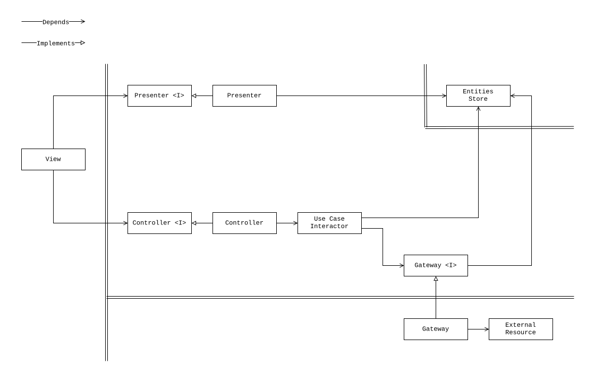
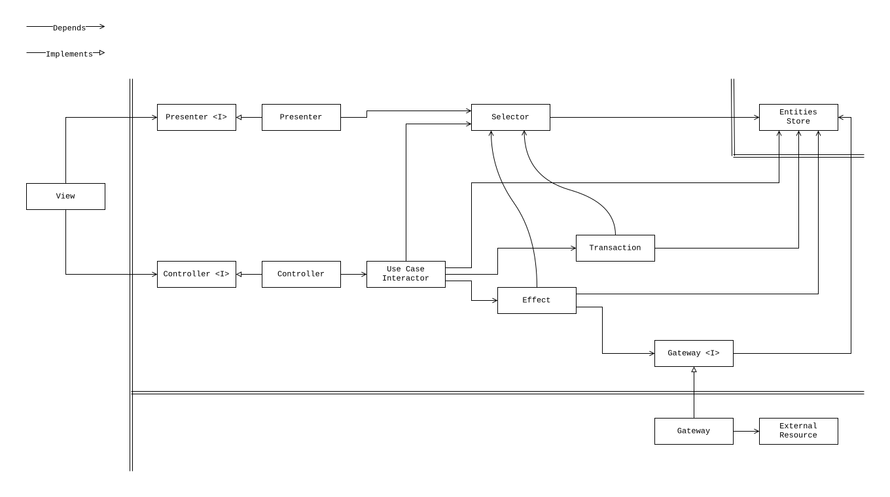

# Clean Architecture Implementation for React Application with Tanstack React Query and Zustand

This project demonstrates a
[Clean Architecture](https://blog.cleancoder.com/uncle-bob/2012/08/13/the-clean-architecture.html)
implementation in a React application using TanStack React Query and Zustand.

By applying Clean Architecture principles, this project maintains structural
integrity, remains straightforward and 💡 easy to understand. The project
demonstrates that implementing Clean Architecture in frontend applications
doesn't have to result in unnecessary 🤯 complexity or overengineering.

## Benefits

1. Limited context and low cognitive load, when working with a codebase.
2. Independent, reusable and portable code units with separated concerns.
3. Unified control and data flow throughout the application.
4. Testable code with clear boundaries for unit and integration tests, where
   tests are inline application specifications.

Apart from human developers, these benefits apply well to AI assistants, helping
reduce code entropy through multiple repeated iterations.

## Clean Architecture Implementation

The diagram below represents a basic implementation of Clean Architecture for a
typical frontend application with a store and API integration. The
implementation can be used with any modern reactive frontend framework, like
React, Vue, Svelte, or Angular.



The next diagram represents an extended implementation of Clean Architecture for
a typical frontend application. The diagram shows additional units into which an
application can be factored.



> NOTE: the double lines on both diagrams are representing the boundaries
> between the units. Typically the data that crosses the boundaries is simple
> data structures, for example Data Transfer Objects (DTOs) or plain objects.

## Definition of units

- **Enterprise Business Entity (EB Entity)**: Unit that encapsulates enterprise
  business rules and data.
- **Application Business Entity (AB Entity)**: Unit that encapsulates
  application-specific business rules and data.
- **Entities Store**: An aggregate unit that maintains a collection of enterprise
  business entities and/or application business entities and their states.
- **Use Case Interactor**: Unit that orchestrates the flow of data in the
  application by coordinating entities, gateways, and transactions to fulfill
  specific user goals, implements application business rules.
- **Transaction**: Unit with logic that transitions a store between two valid
  states, ensuring business rules are maintained.
- **Selector**: Unit that derives values or data structures from the state
  without modifying it, implementing read-only queries against the state,
  implements application business rules.
- **Gateway**: Unit that isolates external resources by providing interfaces for
  data access, mapping data from external resources into entities, and potentially
  caching data.
- **Effect**: Unit that is responsible for encapsulating logic that interacts with
  external resources through gateways, managing side effects, and handling
  asynchronous operations.
- **Controller**: Unit that handles input data from the view and converts it
  into use case invocations.
- **Presenter**: Unit that transforms the application state into output data
  suitable for the view, often using selectors.
- **View**: Unit that is responsible for displaying information to the user
  based on the data prepared by the presenter and for capturing user input and
  transferring it to the controller.
- **External Resource**: External systems or services that the application
  interacts with, such as APIs, databases, storages, or other applications.

## Definition of concepts utilized by the units

- **Enterprise Business Rules and Data**: The most general and high-level rules
  and data that would exist even if the application didn't. These are
  enterprise-wide rules that rarely change and are independent of any specific
  application.
- **Application Business Rules and Data**: Rules and data specific to the
  application's functionality and presentation. This includes how business
  concepts are presented to users, interaction flows, UI state management, and
  application-specific behaviors. These are more likely to change compared to
  enterprise rules.
- **State**: The value of a store at a given point in time, typically
  represented as an object structure.
- **Valid State**: One of a finite number of store values that is conceptually
  considered valid according to business and application rules.

## Dependency Graphs

Dependency graph of the code units.


## File Structure of Orders Module

```console
./src/features/orders
├── api
│   ├── api.types.ts
│   ├── httpClient
│   │   ├── httpClient.ts
│   │   └── index.ts
│   ├── index.ts
│   └── OrdersApi
│       ├── index.ts
│       ├── OrdersApi.factory.ts
│       ├── OrdersApi.ts
│       └── OrdersApi.types.ts
├── cli
│   ├── cli.tsx
│   ├── commands
│   │   ├── DeleteOrder.tsx
│   │   ├── index.ts
│   │   └── SwitchOrdersResource.tsx
│   └── index.ts
├── gateways
│   ├── index.ts
│   └── OrdersGateway
│       ├── hooks
│       │   ├── index.ts
│       │   ├── useDeleteOrderItemKey.ts
│       │   ├── useDeleteOrderItemOptions.ts
│       │   ├── useDeleteOrderKey.ts
│       │   ├── useDeleteOrderOptions.ts
│       │   ├── useGetOrdersKey.ts
│       │   ├── useGetOrdersOptions.ts
│       │   └── useOrdersGateway.ts
│       ├── index.ts
│       ├── LocalOrdersGateway
│       │   ├── index.ts
│       │   ├── LocalOrdersGateway.spec.ts
│       │   └── LocalOrdersGateway.ts
│       ├── makeOrderEntities.ts
│       └── RemoteOrdersGateway
│           ├── index.ts
│           ├── mappers.ts
│           ├── RemoteOrdersGateway.spec.ts
│           └── RemoteOrdersGateway.ts
├── hooks
│   ├── selectors
│   │   ├── index.ts
│   │   ├── useIsLastItemIdSelector
│   │   │   ├── index.ts
│   │   │   ├── select.spec.ts
│   │   │   ├── select.ts
│   │   │   └── useIsLastItemIdSelector.ts
│   │   ├── useIsLastOrderIdSelector.ts
│   │   ├── useIsOrdersProcessingSelector
│   │   │   ├── index.ts
│   │   │   ├── useIsOrdersProcessingSelector.spec.tsx
│   │   │   └── useIsOrdersProcessingSelector.ts
│   │   ├── useItemByIdSelector.ts
│   │   ├── useOrderByIdSelector.ts
│   │   ├── useOrderIdsSelector.ts
│   │   ├── useOrdersResourceSelector.ts
│   │   └── useTotalItemsQuantitySelector
│   │       ├── index.ts
│   │       ├── useTotalItemsQuantitySelector.spec.tsx
│   │       └── useTotalItemsQuantitySelector.ts
│   └── useCases
│       ├── index.ts
│       └── useDeleteOrderUseCase
│           ├── index.ts
│           ├── useDeleteOrderUseCase.spec.tsx
│           └── useDeleteOrderUseCase.ts
├── index.ts
├── stores
│   ├── hooks
│   │   ├── index.ts
│   │   └── useOrdersPresentationStore.ts
│   ├── index.ts
│   └── ordersPresentationStore.ts
├── types
│   ├── entities
│   │   ├── index.ts
│   │   ├── ItemEntity
│   │   │   ├── index.ts
│   │   │   └── ItemEntity.ts
│   │   ├── OrderEntity
│   │   │   ├── index.ts
│   │   │   └── OrderEntity.ts
│   │   └── OrdersPresentationEntity.ts
│   ├── gateways
│   │   ├── index.ts
│   │   └── OrdersGateway.ts
│   ├── index.ts
│   └── OrdersResource.ts
├── utils
│   ├── index.ts
│   └── testing
│       ├── index.ts
│       ├── itemEntityFactory.ts
│       ├── makeComponentFixture.tsx
│       ├── makeOrderEntities.ts
│       ├── orderEntityFactory.ts
│       └── stubUseOrdersGateway.ts
└── views
    ├── containers
    │   ├── index.ts
    │   ├── Order
    │   │   ├── hooks
    │   │   │   ├── index.ts
    │   │   │   ├── useController.ts
    │   │   │   └── usePresenter
    │   │   │       ├── index.ts
    │   │   │       ├── usePresenter.spec.ts
    │   │   │       └── usePresenter.ts
    │   │   ├── index.ts
    │   │   ├── Order.tsx
    │   │   └── Order.types.ts
    │   ├── OrderItem
    │   │   ├── hooks
    │   │   │   ├── index.ts
    │   │   │   ├── useController
    │   │   │   │   ├── index.ts
    │   │   │   │   ├── useController.spec.tsx
    │   │   │   │   └── useController.ts
    │   │   │   └── usePresenter.ts
    │   │   ├── index.ts
    │   │   ├── OrderItem.tsx
    │   │   └── OrderItem.types.ts
    │   ├── Orders
    │   │   ├── hooks
    │   │   │   ├── index.ts
    │   │   │   ├── useController.ts
    │   │   │   └── usePresenter.ts
    │   │   ├── index.ts
    │   │   ├── Orders.spec.tsx
    │   │   ├── Orders.tsx
    │   │   └── Orders.types.ts
    │   └── OrdersResourcePicker
    │       ├── index.ts
    │       └── OrdersResourcePicker.tsx
    ├── index.ts
    └── testIds.ts
```
