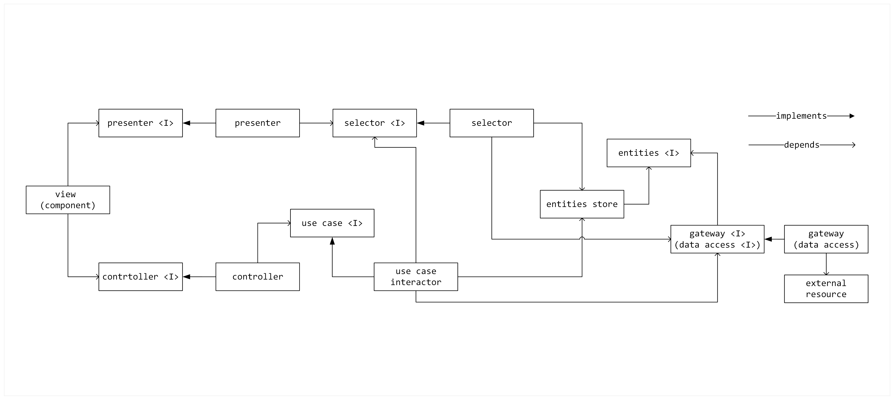
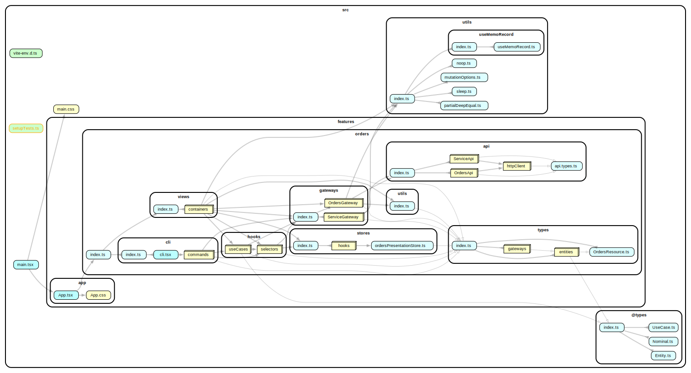

# Clean Architecture Implementation for React Application with Tanstack React Query and Zustand

This project demonstrates a [Clean Architecture](https://blog.cleancoder.com/uncle-bob/2012/08/13/the-clean-architecture.html)
implementation in a React application using TanStack React Query and Zustand.

By applying Clean Architecture principles, this project maintains both
structural integrity and remains straightforward and 💡 easy to understand. The
project demonstrates that implementing Clean Architecture in frontend
applications doesn't have to result in unnecessary 🤯 complexity or
overengineering.

## Benefits

1. Low cognitive load when working with a codebase.
2. Unified control and data flow throughout the application.
3. Independent and reusable code units with separated concerns.
4. Testable code with clear boundaries for unit and integration tests.

## Definitions

- **Enterprise Business Rules and Data**: The most general and high-level rules
  and data that would exist even if the application didn't. These are
  enterprise-wide rules that rarely change and are independent of any specific
  application.
- **Enterprise Business Entity**: Unit that encapsulates enterprise business
  rules and data. These entities represent the core business concepts and are
  technology-agnostic, containing no dependencies on frameworks or external
  systems.
- **Application Business Rules and Data**: Rules and data specific to the
  application's functionality and presentation. This includes how business
  concepts are presented to users, interaction flows, UI state management, and
  application-specific behaviors. These are more likely to change compared to
  enterprise rules.
- **Application Business Entity**: Unit that encapsulates application-specific
  business rules and data. These represent concepts that only exist within the
  context of the application. Data and rules specific to how information is
  presented to users, including display preferences, UI behavior, and interaction
  patterns.
- **Store**: An aggregate unit that maintains a collection of business and/or UI
  entities and their states.
- **State**: The value of a store at a given point in time, typically
  represented as an object structure.
- **Valid State**: One of a finite number of store values that is conceptually
  considered valid according to business and application rules.
- **Gateway**: Unit that isolates external resources by providing interfaces for
  data access, mapping data from external resources into entities, and potentially
  caching data.
- **Selector**: Unit that derives values or data structures from the state
  without modifying it, implementing read-only queries against the state.
- **Transaction**: Unit with logic that transitions a store between two valid
  states, ensuring business rules are maintained.
- **Use Case**: Unit that orchestrates the flow of data in the application by
  coordinating entities, gateways, and transactions to fulfill specific user
  goals, implements application business rules.
- **Controller**: Unit that handles input data from the view and converts it
  into use case invocations.
- **Presenter**: Unit that transforms the application state into output data
  suitable for the view, often using selectors.

## Frontend Clean Architecture Diagram



## Dependency Graphs

Dependency graph of the code units.



## File Structure of Orders Module

```console
./src/features/orders
├── api
│   ├── api.types.ts
│   ├── httpClient
│   │   ├── httpClient.ts
│   │   └── index.ts
│   ├── index.ts
│   ├── OrdersApi
│   │   ├── index.ts
│   │   ├── OrdersApi.factory.ts
│   │   ├── OrdersApi.ts
│   │   └── OrdersApi.types.ts
│   └── ServiceApi
│       ├── index.ts
│       ├── ServiceApi.ts
│       └── ServiceApi.types.ts
├── cli
│   ├── cli.tsx
│   ├── commands
│   │   ├── DeleteOrder.tsx
│   │   └── index.ts
│   └── index.ts
├── gateways
│   ├── index.ts
│   ├── OrdersGateway
│   │   ├── hooks
│   │   │   ├── index.ts
│   │   │   ├── useDeleteOrderItemKey.ts
│   │   │   ├── useDeleteOrderItemOptions.ts
│   │   │   ├── useDeleteOrderKey.ts
│   │   │   ├── useDeleteOrderOptions.ts
│   │   │   ├── useGetOrdersKey.ts
│   │   │   ├── useGetOrdersOptions.ts
│   │   │   └── useOrdersGateway.ts
│   │   ├── index.ts
│   │   ├── LocalOrdersGateway
│   │   │   ├── index.ts
│   │   │   ├── LocalOrdersGateway.spec.ts
│   │   │   └── LocalOrdersGateway.ts
│   │   ├── makeOrderEntities.ts
│   │   └── RemoteOrdersGateway
│   │       ├── index.ts
│   │       ├── mappers.ts
│   │       ├── RemoteOrdersGateway.spec.ts
│   │       └── RemoteOrdersGateway.ts
│   └── ServiceGateway
│       ├── index.ts
│       ├── RemoteServiceGateway
│       │   ├── index.ts
│       │   ├── mappers.ts
│       │   └── RemoteServiceGateway.ts
│       ├── StubServiceGateway.ts
│       └── useServiceGateway.ts
├── hooks
│   ├── selectors
│   │   ├── index.ts
│   │   ├── useIsLastItemIdSelector
│   │   │   ├── index.ts
│   │   │   ├── select.spec.ts
│   │   │   ├── select.ts
│   │   │   └── useIsLastItemIdSelector.ts
│   │   ├── useIsLastOrderIdSelector.ts
│   │   ├── useIsOrdersProcessingSelector
│   │   │   ├── index.ts
│   │   │   ├── useIsOrdersProcessingSelector.spec.tsx
│   │   │   └── useIsOrdersProcessingSelector.ts
│   │   ├── useItemByIdSelector.ts
│   │   ├── useOrderByIdSelector.ts
│   │   ├── useOrderIdsSelector.ts
│   │   ├── useOrdersResourceSelector.ts
│   │   └── useTotalItemsQuantitySelector
│   │       ├── index.ts
│   │       ├── useTotalItemsQuantitySelector.spec.tsx
│   │       └── useTotalItemsQuantitySelector.ts
│   └── useCases
│       ├── index.ts
│       └── useDeleteOrderUseCase
│           ├── index.ts
│           ├── useDeleteOrderUseCase.spec.tsx
│           └── useDeleteOrderUseCase.ts
├── index.ts
├── stores
│   ├── hooks
│   │   ├── index.ts
│   │   └── useOrdersPresentationStore.ts
│   ├── index.ts
│   └── ordersPresentationStore.ts
├── types
│   ├── entities
│   │   ├── index.ts
│   │   ├── ItemEntity
│   │   │   ├── index.ts
│   │   │   └── ItemEntity.ts
│   │   ├── OrderEntity
│   │   │   ├── index.ts
│   │   │   └── OrderEntity.ts
│   │   └── OrdersPresentationEntity.ts
│   ├── gateways
│   │   ├── index.ts
│   │   ├── OrdersGateway.ts
│   │   └── ServiceGateway.ts
│   ├── index.ts
│   └── OrdersResource.ts
├── utils
│   ├── index.ts
│   └── testing
│       ├── index.ts
│       ├── itemEntityFactory.ts
│       ├── makeComponentFixture.tsx
│       ├── makeOrderEntities.ts
│       ├── orderEntityFactory.ts
│       └── stubUseOrdersGateway.ts
└── views
    ├── containers
    │   ├── index.ts
    │   ├── Order
    │   │   ├── hooks
    │   │   │   ├── index.ts
    │   │   │   ├── useController.ts
    │   │   │   └── usePresenter
    │   │   │       ├── index.ts
    │   │   │       ├── usePresenter.spec.ts
    │   │   │       └── usePresenter.ts
    │   │   ├── index.ts
    │   │   ├── Order.tsx
    │   │   └── Order.types.ts
    │   ├── OrderItem
    │   │   ├── hooks
    │   │   │   ├── index.ts
    │   │   │   ├── useController
    │   │   │   │   ├── index.ts
    │   │   │   │   ├── useController.spec.tsx
    │   │   │   │   └── useController.ts
    │   │   │   └── usePresenter.ts
    │   │   ├── index.ts
    │   │   ├── OrderItem.tsx
    │   │   └── OrderItem.types.ts
    │   ├── Orders
    │   │   ├── hooks
    │   │   │   ├── index.ts
    │   │   │   ├── useController.ts
    │   │   │   └── usePresenter.ts
    │   │   ├── index.ts
    │   │   ├── Orders.spec.tsx
    │   │   ├── Orders.tsx
    │   │   └── Orders.types.ts
    │   └── OrdersResourcePicker
    │       ├── index.ts
    │       └── OrdersResourcePicker.tsx
    ├── index.ts
    └── testIds.ts
```
