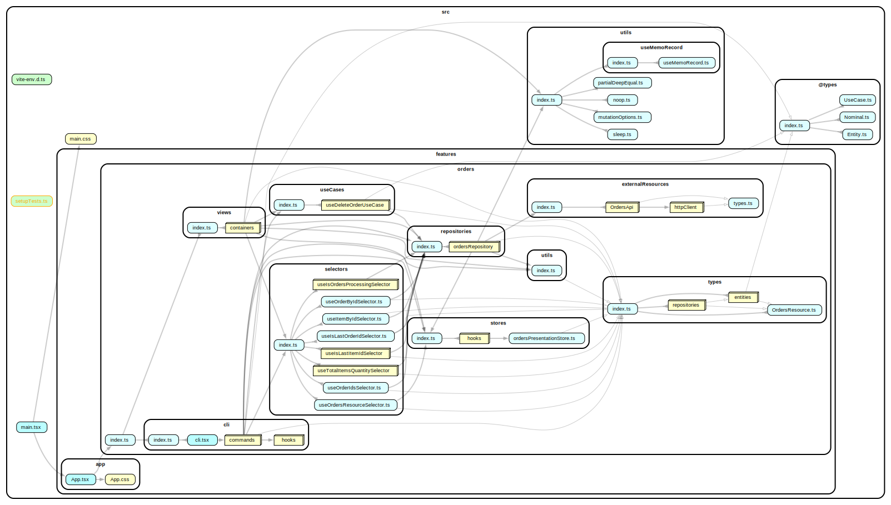

# Clean Architecture for frontend applications

This project demonstrates
[Clean Architecture](https://blog.cleancoder.com/uncle-bob/2012/08/13/the-clean-architecture.html)
in a frontend application with React, TanStack React Query and Zustand.

The project demonstrates that applying Clean Architecture principles in frontend
applications does not have to lead to unnecessary 🤯 complexity or
over-engineering. Instead, it simplifies the development process while providing
all the benefits 💡 of Clean Architecture.

A brief overview of the concept can be found here:

- [Frontend Clean Architecture: Practical Insights and Pitfalls](https://dev.to/harunou/clean-architecture-practical-insights-and-pitfalls-1mdj)
- [Clean Architecture for Frontend Applications](https://dev.to/harunou/clean-architecture-in-frontend-applications-overview-4o89)

## Extending Basic Clean Architecture Implementation

This application uses TanStack React Query for server state management and
synchronization states, which is a natural fit for a repository unit.

The following diagram illustrates the Clean Architecture implementation with a
repository unit. The current application follows it.


- The _Repository unit_ is responsible for managing server state, maintaining
  synchronization states, and providing a consistent interface for the rest of
  the application.
- The _Gateway unit_ abstracts and communicates with the API, transforming data
  into a format suitable for the repository unit. Using a gateway is recommended
  when the application has multiple API endpoints (e.g., an entity is built from
  multiple external resources) or stores data in different locations (e.g., in
  memory, on a server, or in browser storage).

## Dependency Graphs

Dependency graph of the code units.



## File Structure of Orders Module

```console
./src/features/orders
├── cli
│   ├── cli.tsx
│   ├── commands
│   │   ├── DeleteOrder
│   │   │   ├── DeleteOrder.tsx
│   │   │   ├── DeleteOrder.types.tsx
│   │   │   ├── hooks
│   │   │   │   ├── index.ts
│   │   │   │   ├── useController.ts
│   │   │   │   └── usePresenter.ts
│   │   │   └── index.ts
│   │   ├── index.ts
│   │   ├── PrintAvailableOrderIds.tsx
│   │   ├── PrintOrdersResource.tsx
│   │   └── SwitchOrdersResource.tsx
│   ├── hooks
│   │   └── useConsoleRenderer.ts
│   └── index.ts
├── externalResources
│   ├── httpClient
│   │   ├── httpClient.ts
│   │   └── index.ts
│   ├── index.ts
│   ├── OrdersApi
│   │   ├── index.ts
│   │   ├── OrdersApi.factory.ts
│   │   ├── OrdersApi.ts
│   │   └── OrdersApi.types.ts
│   └── types.ts
├── index.ts
├── repositories
│   ├── index.ts
│   └── ordersRepository
│       ├── hooks
│       │   ├── index.ts
│       │   ├── useGatewayResource.ts
│       │   └── useOrdersGateway.ts
│       ├── index.ts
│       ├── OrdersGateway
│       │   ├── index.ts
│       │   ├── InMemoryOrdersGateway
│       │   │   ├── index.ts
│       │   │   ├── InMemoryOrdersGateway.spec.ts
│       │   │   └── InMemoryOrdersGateway.ts
│       │   ├── makeOrderEntities.ts
│       │   ├── OrdersGateway.types.ts
│       │   └── RemoteOrdersGateway
│       │       ├── index.ts
│       │       ├── mappers.ts
│       │       ├── RemoteOrdersGateway.spec.ts
│       │       └── RemoteOrdersGateway.ts
│       ├── ordersRepositoryKeys.ts
│       └── ordersRepository.ts
├── selectors
│   ├── index.ts
│   ├── useIsLastItemIdSelector
│   │   ├── index.ts
│   │   ├── useIsLastItemIdSelector.spec.ts
│   │   └── useIsLastItemIdSelector.ts
│   ├── useIsLastOrderIdSelector.ts
│   ├── useIsOrdersProcessingSelector
│   │   ├── index.ts
│   │   ├── useIsOrdersProcessingSelector.spec.tsx
│   │   └── useIsOrdersProcessingSelector.ts
│   ├── useItemByIdSelector.ts
│   ├── useOrderByIdSelector.ts
│   ├── useOrderIdsSelector.ts
│   ├── useOrdersResourceSelector.ts
│   └── useTotalItemsQuantitySelector
│       ├── index.ts
│       ├── useTotalItemsQuantitySelector.spec.tsx
│       └── useTotalItemsQuantitySelector.ts
├── stores
│   ├── hooks
│   │   ├── index.ts
│   │   └── useOrdersPresentationStore.ts
│   ├── index.ts
│   └── ordersPresentationStore.ts
├── types
│   ├── entities
│   │   ├── index.ts
│   │   ├── ItemEntity
│   │   │   ├── index.ts
│   │   │   └── ItemEntity.ts
│   │   ├── OrderEntity
│   │   │   ├── index.ts
│   │   │   └── OrderEntity.ts
│   │   └── OrdersPresentationEntity.ts
│   ├── index.ts
│   ├── OrdersResource.ts
│   └── repositories
│       ├── index.ts
│       └── OrdersRepository.ts
├── useCases
│   ├── index.ts
│   └── useDeleteOrderUseCase
│       ├── index.ts
│       ├── useDeleteOrderUseCase.spec.tsx
│       └── useDeleteOrderUseCase.ts
├── utils
│   ├── index.ts
│   └── testing
│       ├── index.ts
│       ├── itemEntityFactory.ts
│       ├── makeComponentFixture.tsx
│       ├── makeOrderEntities.ts
│       ├── mockUseOrdersGateway.ts
│       └── orderEntityFactory.ts
└── views
    ├── containers
    │   ├── index.ts
    │   ├── Order
    │   │   ├── hooks
    │   │   │   ├── index.ts
    │   │   │   ├── useController.ts
    │   │   │   └── usePresenter
    │   │   │       ├── index.ts
    │   │   │       ├── usePresenter.spec.ts
    │   │   │       └── usePresenter.ts
    │   │   ├── index.ts
    │   │   ├── Order.tsx
    │   │   └── Order.types.ts
    │   ├── OrderItem
    │   │   ├── hooks
    │   │   │   ├── index.ts
    │   │   │   ├── useController
    │   │   │   │   ├── index.ts
    │   │   │   │   ├── useController.spec.tsx
    │   │   │   │   └── useController.ts
    │   │   │   └── usePresenter.ts
    │   │   ├── index.ts
    │   │   ├── OrderItem.tsx
    │   │   └── OrderItem.types.ts
    │   ├── Orders
    │   │   ├── hooks
    │   │   │   ├── index.ts
    │   │   │   ├── useController.ts
    │   │   │   └── usePresenter.ts
    │   │   ├── index.ts
    │   │   ├── Orders.spec.tsx
    │   │   ├── Orders.tsx
    │   │   └── Orders.types.ts
    │   └── OrdersResourcePicker
    │       ├── index.ts
    │       └── OrdersResourcePicker.tsx
    ├── index.ts
    └── testIds.ts

41 directories, 107 files
```
